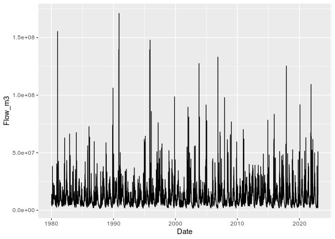
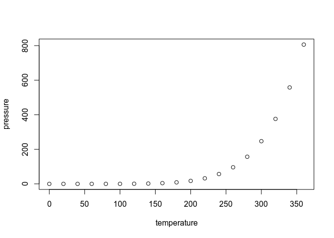

<!-- README.md is generated from README.Rmd. Please edit that file -->

# bfsep

<!-- badges: start -->
<!-- badges: end -->

The goal of bfsep is to …

## Installation

You can install the development version of bfsep from
[GitHub](https://github.com/) with:

``` r
# install.packages("devtools")
devtools::install_github("jvandens/bfsep")
```

## Example

This is a basic example which shows you how to solve a common problem:

``` r
library(bfsep)
library(dataRetrieval)
library(magrittr)
library(dplyr)
#> 
#> Attaching package: 'dplyr'
#> The following objects are masked from 'package:stats':
#> 
#>     filter, lag
#> The following objects are masked from 'package:base':
#> 
#>     intersect, setdiff, setequal, union
library(ggplot2)

## basic example code

# SAUK RIVER NEAR SAUK, WA
siteNumber <- "12189500"
parameterCd <- "00060"  #discharge in cfs

# Raw daily data:
rawDailyData <- readNWISdv(
  siteNumber,
  parameterCd,
  startDate = "1980-01-01",
  endDate = "2023-01-01")
  
```

Rename the columns to ‘friendly’ names and the bfsep model requires flow
to be in m3/day so add a conversion column as default returned is in cfs

``` r
# rename to friendly names and convert to m3/day
rawDailyData <- renameNWISColumns(rawDailyData) %>% 
  mutate(Flow_m3 = Flow / 35.3147 * 3600 * 24)
```

Plot the data as a quick check…

``` r
ggplot(rawDailyData, aes(x=Date, y=Flow_m3)) +
  geom_line()
```



bfsep has helper functions to lookup the parameters for a site

``` r

# model args
basin_char <- basin_char(siteNumber) 
gw_hyd <- gw_hyd(siteNumber)
flow <- flow(siteNumber) 
timestep <- 'day' 
error_basis <- 'total' 

# prepare the gage data as vectors
dt <- rawDailyData$Date #VECTOR OF DATES
qin <- rawDailyData$Flow_m3 #VECTOR OF DAILY STREAMFLOW VALUES IN M3/day
```

``` r
sep <- bf_sep(qin, dt, timestep, error_basis, basin_char, gw_hyd, flow)
#> [1] 0.02393696
```

What is special about using `README.Rmd` instead of just `README.md`?
You can include R chunks like so:

``` r
summary(cars)
#>      speed           dist       
#>  Min.   : 4.0   Min.   :  2.00  
#>  1st Qu.:12.0   1st Qu.: 26.00  
#>  Median :15.0   Median : 36.00  
#>  Mean   :15.4   Mean   : 42.98  
#>  3rd Qu.:19.0   3rd Qu.: 56.00  
#>  Max.   :25.0   Max.   :120.00
```

You’ll still need to render `README.Rmd` regularly, to keep `README.md`
up-to-date. `devtools::build_readme()` is handy for this. You could also
use GitHub Actions to re-render `README.Rmd` every time you push. An
example workflow can be found here:
<https://github.com/r-lib/actions/tree/v1/examples>.

You can also embed plots, for example:



In that case, don’t forget to commit and push the resulting figure
files, so they display on GitHub and CRAN.
