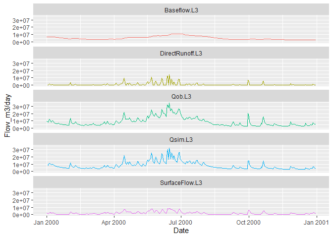

<!-- README.md is generated from README.Rmd. Please edit that file and build with devtools::build_readme() -->

# bfsep

<!-- badges: start -->
<!-- badges: end -->

The baseflow separation model `bfsep` is a wrapper library around the
[code and
tools](https://www.sciencebase.gov/catalog/item/5f90ef0282ce720ee2d29b7e)
built by Christopher Konrad at USGS (Konrad 2020) and is used for the
estimation of the baseflow component of streamflow and is executed as a
set of 12 functions. The model is run using the function `bf_sep()`,
which requires six arguments. All other functions are called by
`bf_sep()`. All required functions can be loaded in the library:

``` r
library(bfsep)
```

The model has been calibrated for 13208 selected gaging sites.
Parameters are available for the USGS gage parameters dataset
`bf_params_usgs` included with this package, as excerpted below.
Description of the parameters in this dataset can be viewed by calling
the help `?bf_params_usgs`.

``` r
knitr::kable(tail(bf_params_usgs), digits=2, format.args = list(scientific = FALSE))
```

|       | site_no  |      AREA |       Lb |       X1 |      Wb |  POR | ALPHA |  BETA |     Ks |      Kb |   Kz |   Qthresh |    Rs |   Rb1 |   Rb2 |    Prec | Frac4Rise | Error |
|:------|:---------|----------:|---------:|---------:|--------:|-----:|------:|------:|-------:|--------:|-----:|----------:|------:|------:|------:|--------:|----------:|------:|
| 13203 | 50148890 | 242176000 | 34713.66 | 26804.42 | 1100.43 | 0.15 |  0.00 | 17.53 |  84.51 | 1520.39 | 0.33 | 269158.88 | -0.35 | -0.08 | -0.01 | 3889.35 |      0.05 |  0.03 |
| 13204 | 50252000 |   1254400 |  1814.29 |   182.12 |   53.99 | 0.15 |  0.00 |  1.00 |  44.46 |  226.69 | 0.03 |     48.94 | -0.35 | -0.03 |  0.00 |   24.47 |      0.05 |  0.04 |
| 13205 | 50274000 |   5964800 |  6519.25 |  1406.67 |   43.04 | 0.15 |  0.01 |  2.40 | 641.71 | 1083.45 | 0.05 |     97.88 | -0.35 | -0.04 |  0.00 |   24.47 |      0.05 |  0.05 |
| 13206 | 50295000 |    947200 |   197.17 |   104.47 | 1037.47 | 0.15 |  0.00 |  1.00 |   1.73 |    3.91 | 0.04 |     48.94 | -0.35 | -0.03 |  0.00 |   24.47 |      0.05 |  0.02 |
| 13207 | 50333500 |  13824000 |  7495.11 |     2.46 |   69.39 | 0.15 |  0.00 |  1.10 | 530.88 | 1001.58 | 0.01 |    509.93 | -0.76 | -0.33 | -0.33 |   24.47 |      0.05 |  0.00 |
| 13208 | 50345000 |   5376000 |  3156.42 |   137.89 |   62.39 | 0.15 |  0.00 |  1.06 | 103.10 |  653.17 | 0.00 |     48.94 | -0.20 | -0.03 |  0.00 |   24.47 |      0.05 |  0.08 |

Sites are in rows with identification number in the first column, the 16
parameters values, and the error for the calibration.

The parameters for a site must be concatenated into 3 vectors with six
elements each before using them as arguments to `bf_sep()`. Helper
functions for each set exist to facilitate retrieving the gage-specific
parameters.

`bfsep` works best in conjunction with the USGS `dataRetrieval` package
to fetch time-series data from specific gages.

## Installation

You can install the development version of `bfsep` from
[GitHub](https://github.com/) with:

``` r
# install.packages("devtools")
devtools::install_github("jvandens/bfsep")
```

## Example

This is a basic example which shows how to download discharge data from
a single USGS site and calculate the baseflow separation

``` r

library(dataRetrieval)

# SAUK RIVER NEAR SAUK, WA
siteNumber <- "12189500"
parameterCd <- "00060"  #discharge in cfs

# Raw daily data:
rawDailyData <- readNWISdv(
  siteNumber,
  parameterCd,
  startDate = "2000-01-01",
  endDate = "2000-12-31")
```

Rename the columns to ‘friendly’ names and the `bfsep` model requires
flow to be in m3/day so add a conversion column as default returned is
in cfs

``` r

library(magrittr)

# rename to friendly names and convert to m3/day
rawDailyData <- renameNWISColumns(rawDailyData) %>% 
  dplyr::mutate(Flow_m3 = Flow / 35.3147 * 3600 * 24)
```

Plot the data as a quick check

``` r

library(ggplot2)

ggplot(rawDailyData, aes(x=Date, y=Flow_m3)) +
  geom_line()
```


bfsep has helper functions to lookup the parameters for a site which are
required for the model. The gage-specific parameters required are the
basin characteristics (`basin_char()`), groundwater hydrology
(`gw_hyd()`), and flow parameters (`flow()`). Each of these functions
takes the USGS gage ID character string as it’s single argument.

``` r

# model args
basin_char <- basin_char(siteNumber) 
gw_hyd <- gw_hyd(siteNumber)
flow <- flow(siteNumber) 
timestep <- 'day' 
error_basis <- 'total' 

# prepare the gage data as vectors
dt <- rawDailyData$Date #VECTOR OF DATES
qin <- rawDailyData$Flow_m3 #VECTOR OF DAILY STREAMFLOW VALUES IN M3/day
```

Run the baseflow separation model, save the results to a dataframe and
output the associated error

``` r
sep <- bf_sep(qin, dt, timestep, error_basis, basin_char, gw_hyd, flow)
#> [1] 0.01406752
```

A basic plot of the results:

``` r

sep.plt <- sep %>% 
  dplyr::select(Date:DirectRunoff.L3) %>% 
  tidyr::pivot_longer(2:6, names_to = "var", values_to = "Flow_m3/day") 

ggplot(sep.plt, aes(x = Date, y = `Flow_m3/day`, color = var)) +
  geom_line(show.legend = FALSE) +
  facet_wrap(~var, ncol=1)
#> Warning: Removed 2 row(s) containing missing values (geom_path).
```



# References

<!--
You'll still need to render `README.Rmd` regularly, to keep `README.md` up-to-date. `devtools::build_readme()` is handy for this. You could also use GitHub Actions to re-render `README.Rmd` every time you push. An example workflow can be found here: <https://github.com/r-lib/actions/tree/v1/examples>. 
-->

<div id="refs" class="references csl-bib-body hanging-indent">

<div id="ref-Konrad2020" class="csl-entry">

Konrad, Christopher P. 2020. “<span class="nocase">Non-linear baseflow
separation model with parameters and results (ver. 2.0, October
2022)</span>.” *U.S. Geological Survey Data Release*.
https://doi.org/<https://doi.org/10.5066/P9AIPHEP>.

</div>

</div>
