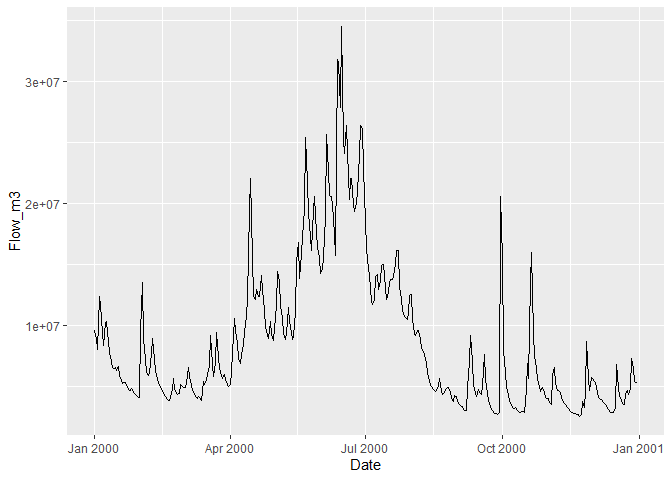

<!-- README.md is generated from README.Rmd. Please edit that file and build with devtools::build_readme() -->

# bfsep

<!-- badges: start -->
<!-- badges: end -->

The baseflow separation model `bfsep` is a wrapper library around the
[code and
tools](https://www.sciencebase.gov/catalog/item/5f90ef0282ce720ee2d29b7e)
built by Christopher Konrad at USGS (Konrad 2020) and is used for the
estimation of the baseflow component of streamflow and is executed as a
set of 12 functions. The model is run using the function `bf_sep()`,
which requires six arguments. All other functions are called by
`bf_sep()`. All required functions can be loaded in the library:

``` r
library(bfsep)
```

The model has been calibrated for 13208 selected gaging sites.
Parameters are available for the USGS gage parameters dataset
`bf_params_usgs` included with this package, as excerpted below.
Description of the parameters in this dataset can be viewed by calling
the help `?bf_params_usgs`.

``` r
head(bf_params_usgs)
#>    site_no       AREA        Lb        X1           Wb  POR        ALPHA
#> 1 01010000 3432960000 42195.004 30268.421    3899.4916 0.15 6.991589e-03
#> 2 01010070  437760000 22947.464 15020.629 1426149.7464 0.15 4.496731e-09
#> 3 01010500 6860800000 30622.345 16697.526    4599.4746 0.15 8.809516e-03
#> 4 01011000 3783680000 24340.048 13850.519    7682.9840 0.15 8.504163e-03
#> 5 01012515   33280000  7922.068  4911.786     731.9395 0.15 3.732992e-02
#> 6 01012520    5196800  1997.463  1163.064     226.5779 0.15 1.105229e-02
#>        BETA           Ks        Kb        Kz     Qthresh          Rs
#> 1 17.891344 1.202191e+04 1346.6735 0.2265222 653322.0051 -0.11685527
#> 2 21.445829 1.702129e+13  721.4984 0.1865955 100322.8547 -0.13534568
#> 3 17.847130 1.170324e+04 1082.3061 0.1736640 638640.6117 -0.13472433
#> 4  9.946623 7.715101e+03 1227.5351 0.1289749 606830.9261 -0.07401526
#> 5  6.879007 2.742763e+02  542.6453 0.2205462  16621.7842 -0.08372559
#> 6  2.208195 9.004372e+02 1368.8208 0.1592777    171.2829 -0.22792486
#>           Rb1          Rb2        Prec Frac4Rise      Error
#> 1 -0.06032012 -0.010385333 28873.40697      0.05 0.11905442
#> 2 -0.06300632 -0.011841823  3425.65845      0.05 0.09712791
#> 3 -0.05029289 -0.008377966 66511.60578      0.05 0.13351219
#> 4 -0.03335920 -0.007215571 58192.14953      0.05 0.08186208
#> 5 -0.07727862 -0.008515741    36.67901      0.05 0.05996996
#> 6 -0.08109302 -0.008349912    24.46899      0.05 0.17642699
```

Sites are in rows with identification number in the first column, the 16
parameters values, and the error for the calibration.

The parameters for a site must be concatenated into 3 vectors with six
elements each before using them as arguments to `bf_sep()`. Helper
functions for each set exist to facilitate retrieving the gage-specific
parameters.

columns 2:6 for basin_char, columns 7:11 for gw_hyd, and columns 12:17
for flow.

`bfsep` works best in conjunction with the USGS `dataRetrieval` package
to fetch time-series data from specific gages.

## Installation

You can install the development version of `bfsep` from
[GitHub](https://github.com/) with:

``` r
# install.packages("devtools")
devtools::install_github("jvandens/bfsep")
```

## Example

This is a basic example which shows how to download discharge data from
a single USGS site and calculate the baseflow separation

``` r

library(dataRetrieval)
library(magrittr)
library(dplyr)
#> 
#> Attaching package: 'dplyr'
#> The following objects are masked from 'package:stats':
#> 
#>     filter, lag
#> The following objects are masked from 'package:base':
#> 
#>     intersect, setdiff, setequal, union
library(ggplot2)

# SAUK RIVER NEAR SAUK, WA
siteNumber <- "12189500"
parameterCd <- "00060"  #discharge in cfs

# Raw daily data:
rawDailyData <- readNWISdv(
  siteNumber,
  parameterCd,
  startDate = "1980-01-01",
  endDate = "2023-01-01")
```

Rename the columns to ‘friendly’ names and the `bfsep` model requires
flow to be in m3/day so add a conversion column as default returned is
in cfs

``` r
# rename to friendly names and convert to m3/day
rawDailyData <- renameNWISColumns(rawDailyData) %>% 
  mutate(Flow_m3 = Flow / 35.3147 * 3600 * 24)
```

Plot the data as a quick check

``` r
ggplot(rawDailyData, aes(x=Date, y=Flow_m3)) +
  geom_line()
```



bfsep has helper functions to lookup the parameters for a site

``` r

# model args
basin_char <- basin_char(siteNumber) 
gw_hyd <- gw_hyd(siteNumber)
flow <- flow(siteNumber) 
timestep <- 'day' 
error_basis <- 'total' 

# prepare the gage data as vectors
dt <- rawDailyData$Date #VECTOR OF DATES
qin <- rawDailyData$Flow_m3 #VECTOR OF DAILY STREAMFLOW VALUES IN M3/day
```

Run the baseflow separation model, save the results to a dataframe and
output the associated error

``` r
sep <- bf_sep(qin, dt, timestep, error_basis, basin_char, gw_hyd, flow)
#> [1] 0.02393696
```

# References

<!--
You'll still need to render `README.Rmd` regularly, to keep `README.md` up-to-date. `devtools::build_readme()` is handy for this. You could also use GitHub Actions to re-render `README.Rmd` every time you push. An example workflow can be found here: <https://github.com/r-lib/actions/tree/v1/examples>. 
-->

<div id="refs" class="references csl-bib-body hanging-indent">

<div id="ref-Konrad2020" class="csl-entry">

Konrad, Christopher P. 2020. “<span class="nocase">Non-linear baseflow
separation model with parameters and results (ver. 2.0, October
2022)</span>.” *U.S. Geological Survey Data Release*.
https://doi.org/<https://doi.org/10.5066/P9AIPHEP>.

</div>

</div>
